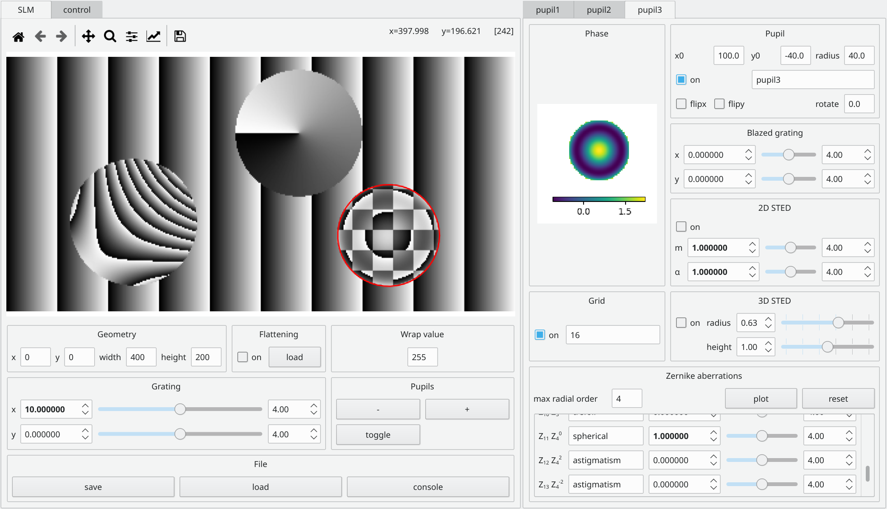

# SLM

Spatial light modulator in Python.

## Main Features

* 2D and 3D STED masks
* multiple passes
* Zernike aberration control

## Installation

To install `slm` in Windows, follow the steps below.

- You should first install the following software requirements:
    - [Anaconda for Python 3](https://www.anaconda.com/download). This includes
      Python as well as some necessary scientific libraries.
    - [Git](https://git-scm.com/download/win). This is necessary for the
      automatic version numbering of this package. Also, make sure you choose
      *Git from the command line and also 3rd-party software* in *Adjusting
      your PATH environment*.
- *Clone* this repository using Git. From any folder in File Explorer,
  right-click and hit *Git Bash here*. Paste `git clone
  https://github.com/jacopoantonello/slm` and hit enter. Do not use GitHub's
  *Download ZIP* button above, as the installation script will not work in that
  case.
- Finally, double-click on `install.bat`.

To run the GUI, double-click on `run.bat`.
